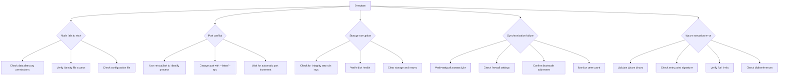

# Troubleshooting

<cite>
**Referenced Files in This Document**   
- [src/cli.rs](file://src/cli.rs)
- [src/node.rs](file://src/node.rs)
- [src/rpc/mod.rs](file://src/rpc/mod.rs)
- [src/storage/blob_store.rs](file://src/storage/blob_store.rs)
- [src/execution/runtime.rs](file://src/execution/runtime.rs)
- [src/network/service.rs](file://src/network/service.rs)
- [src/syncer/mod.rs](file://src/syncer/mod.rs)
- [src/consensus/mod.rs](file://src/consensus/mod.rs)
</cite>

## Table of Contents
1. [Introduction](#introduction)
2. [Node Startup Failures](#node-startup-failures)
3. [Port Conflicts](#port-conflicts)
4. [Corrupted Storage](#corrupted-storage)
5. [Synchronization Issues](#synchronization-issues)
6. [Wasm Execution Errors](#wasm-execution-errors)
7. [Diagnostic Tools and Methods](#diagnostic-tools-and-methods)
8. [Performance Issues](#performance-issues)
9. [Recovery Procedures](#recovery-procedures)
10. [Troubleshooting Matrix](#troubleshooting-matrix)

## Introduction
This guide provides comprehensive troubleshooting information for the ONVM (Open Network Virtual Machine) system. It addresses common issues encountered during operation, including node startup failures, port conflicts, storage corruption, synchronization problems, and Wasm execution errors. The guide includes diagnostic steps, error message explanations, debugging tools, performance optimization tips, and recovery procedures. Content is structured to be accessible to beginners while providing deep technical details for experts.

## Node Startup Failures

Node startup failures can occur due to various configuration, permission, or dependency issues. The most common startup problems stem from improper data directory initialization, missing identity files, or configuration errors.

When a node fails to start, check the following:
- Ensure the data directory exists and has proper read/write permissions
- Verify that the identity file is present or can be generated
- Confirm that all required dependencies are installed and accessible
- Check that the configuration file is properly formatted

The system automatically attempts to create the data directory if it doesn't exist, but may fail if the parent directory lacks write permissions. The identity is loaded or generated at startup, so missing identity files are typically not a cause for startup failure unless there are permission issues preventing file creation.

**Section sources**
- [src/cli.rs](file://src/cli.rs#L117-L129)
- [src/node.rs](file://src/node.rs#L43-L45)

## Port Conflicts

Port conflicts occur when the requested network or RPC ports are already in use by other processes. The ONVM system attempts to handle port conflicts gracefully by automatically incrementing port numbers when the primary port is unavailable.

For network ports, the system will automatically try the next available TCP port when the configured port is in use. This behavior is implemented in the `bump_tcp_port` function in `node.rs`. For RPC ports, the system will similarly attempt to bind to the next available port in sequence.

Common error messages related to port conflicts include:
- "listen failed" followed by port number
- "address already in use"
- "failed to bind to address"

To resolve port conflicts:
1. Identify which process is using the desired port using system tools (e.g., `netstat`, `lsof`)
2. Either terminate the conflicting process or configure ONVM to use a different port
3. Use the `--listen` and `--rpc` command-line options to specify alternative ports

The system will log warnings when port conflicts occur and automatically attempt to use the next available port, providing information about which port was successfully bound.

**Section sources**
- [src/node.rs](file://src/node.rs#L58-L83)
- [src/rpc/mod.rs](file://src/rpc/mod.rs#L73-L85)

## Corrupted Storage

Storage corruption can occur due to improper shutdown, disk errors, or software bugs. The ONVM system uses Sled as its primary database engine and implements several integrity checks to detect and prevent data corruption.

The system employs Merkle tree verification for blob storage, ensuring data integrity at the chunk level. When reading stored blobs, the system verifies that:
- Chunk hashes match the expected values
- The computed Merkle root matches the stored root
- The total size matches the metadata

If any of these checks fail, the system will return a corruption error rather than serving potentially corrupted data.

Common symptoms of storage corruption include:
- "chunk hash mismatch" errors
- "merkle root mismatch" errors
- "size mismatch on read" errors
- Failure to retrieve previously stored blobs

To diagnose storage corruption:
1. Check system logs for integrity verification failures
2. Verify disk health and available space
3. Check for proper shutdown procedures
4. Monitor for hardware issues

The system's integrity checks prevent the use of corrupted data but do not automatically repair corrupted storage. Recovery typically requires clearing the storage directory and resynchronizing from peers.

**Section sources**
- [src/storage/blob_store.rs](file://src/storage/blob_store.rs#L78-L103)
- [src/storage/blob_store.rs](file://src/storage/blob_store.rs#L48-L76)

## Synchronization Issues

Synchronization issues occur when nodes fail to properly exchange data with peers in the network. The ONVM system uses a gossip-based protocol for data dissemination, with periodic inventory exchanges to identify missing data.

The synchronization process involves:
1. Initial peer discovery through bootnodes and mDNS
2. Exchange of inventory information (programs, blobs, executions)
3. Requesting missing data from peers
4. Verification and storage of received data

Common synchronization problems include:
- Failure to connect to peers
- Incomplete data synchronization
- Stalled synchronization process
- Missing program or blob data

The system logs synchronization progress, including the number of connected peers and synchronization gaps (missing programs, blobs, and executions). The `await_initial_sync` function in the syncer module implements a timeout mechanism to detect synchronization stalls.

To troubleshoot synchronization issues:
1. Verify network connectivity between nodes
2. Check firewall settings that might block peer connections
3. Ensure bootnode addresses are correct and reachable
4. Monitor peer count and synchronization progress in logs
5. Verify that the minimum peer requirement is met

The system requires a minimum number of peers (configurable) before producing blocks, which can affect synchronization in small networks.

**Section sources**
- [src/syncer/mod.rs](file://src/syncer/mod.rs#L15-L40)
- [src/consensus/mod.rs](file://src/consensus/mod.rs#L755-L777)
- [src/network/service.rs](file://src/network/service.rs#L315-L336)

## Wasm Execution Errors

Wasm execution errors occur when programs fail to execute properly in the WebAssembly runtime. The ONVM system uses Wasmtime as its Wasm execution engine, with specific requirements for program structure and entry points.

Common Wasm execution issues include:
- Invalid Wasm binary format
- Missing or incorrect entry point function
- Excessive fuel consumption
- Memory access violations
- Host function call failures

The system validates Wasm modules at deployment time, checking for proper structure and supported features. Programs must export an entry point function with one of the supported signatures:
- `(i32, i32) -> (i32, i32)`
- `(i32, i32) -> i64`
- `(i32, i32, i32) -> ()` with sret

If a program fails to meet these requirements, deployment will fail with an error message indicating the invalid entry point signature.

During execution, the system limits fuel consumption to prevent infinite loops or excessive resource usage. Programs that exceed the fuel limit will be terminated, and the execution will return with the consumed fuel amount.

Host function errors can occur when programs attempt to access blobs or state data that doesn't exist or when there are permission issues. These are typically reported as negative return codes from the host functions.

To troubleshoot Wasm execution errors:
1. Verify the Wasm binary is valid and properly compiled
2. Check that the entry point function has the correct signature
3. Review fuel consumption and adjust limits if necessary
4. Validate that referenced blobs exist before execution
5. Check host function calls for proper parameters

**Section sources**
- [src/execution/runtime.rs](file://src/execution/runtime.rs#L109-L123)
- [src/execution/runtime.rs](file://src/execution/runtime.rs#L99-L100)
- [src/execution/runtime.rs](file://src/execution/runtime.rs#L200-L374)

## Diagnostic Tools and Methods

The ONVM system provides several diagnostic tools and methods to help identify and resolve issues.

### Log Levels and Tracing
The system uses the tracing framework for detailed logging, with configurable log levels. The default log level is "info", but can be adjusted using the `RUST_LOG` environment variable. More verbose logging (level "debug" or "trace") can provide additional insight into system behavior.

Key log messages include:
- Network connection events (connected, disconnected)
- Data synchronization progress
- Block production and validation
- Error conditions and exceptions

### RPC Status Endpoints
The RPC interface provides several endpoints for monitoring node status:
- `/health` - Returns "ok" if the node is running
- `/programs/{id}` - Retrieves program metadata
- `/blobs/{id}` - Retrieves stored blobs

These endpoints can be used to verify data availability and node responsiveness.

### CLI Diagnostic Commands
The command-line interface provides several commands for diagnostics:
- `onvm init` - Initializes a data directory with node keys
- `onvm run-node` - Starts a full ONVM node
- `onvm program-info` - Inspects program metadata
- `onvm get-blob` - Retrieves a stored blob

These commands can be used to verify system functionality and data integrity.

**Section sources**
- [src/cli.rs](file://src/cli.rs#L24-L107)
- [src/rpc/mod.rs](file://src/rpc/mod.rs#L65-L71)
- [src/node.rs](file://src/node.rs#L110-L112)

## Performance Issues

Performance issues in the ONVM system can manifest as high memory usage, slow execution, or network bottlenecks.

### High Memory Usage
High memory usage can occur due to:
- Large numbers of stored programs or blobs
- Inefficient Wasm module caching
- Network buffer accumulation
- State storage growth

The system caches compiled Wasm modules to improve execution performance, but this can lead to increased memory usage with many different programs. The cache is currently unbounded, so memory usage will grow with the number of unique programs executed.

### Slow Execution
Slow Wasm execution can be caused by:
- Complex program logic
- Excessive fuel limits
- Host function call overhead
- Memory allocation patterns

Programs with complex algorithms or large memory requirements will naturally take longer to execute. The fuel-based execution limiting system can also impact perceived performance, as programs near their fuel limit may be terminated prematurely.

### Network Bottlenecks
Network bottlenecks can occur due to:
- High data synchronization load
- Limited bandwidth connections
- Inefficient data dissemination
- Peer discovery delays

The gossip-based protocol can generate significant network traffic during initial synchronization or when many new programs/blobs are introduced to the network.

To optimize performance:
1. Monitor memory usage and consider implementing cache limits
2. Optimize Wasm programs for efficiency
3. Adjust fuel limits based on program requirements
4. Ensure adequate network bandwidth
5. Optimize peer connections and topology

**Section sources**
- [src/execution/runtime.rs](file://src/execution/runtime.rs#L74-L76)
- [src/execution/runtime.rs](file://src/execution/runtime.rs#L185-L195)
- [src/network/service.rs](file://src/network/service.rs#L221-L229)

## Recovery Procedures

When encountering persistent issues, several recovery procedures can be employed.

### Clearing Storage
To clear corrupted or problematic storage:
1. Stop the ONVM node
2. Remove the data directory (typically "./data" or specified with `--data-dir`)
3. Restart the node, which will initialize a new data directory

This will remove all local programs, blobs, and state, requiring resynchronization from peers.

### Regenerating Identity
To regenerate node identity:
1. Stop the ONVM node
2. Remove the identity file in the data directory
3. Restart the node, which will generate a new identity

This changes the node's peer ID and may affect its reputation or relationships in the network.

### Resyncing from Peers
To force resynchronization from peers:
1. Ensure the node is connected to healthy peers
2. The system will automatically request inventory and missing data
3. Monitor synchronization progress in logs

The synchronization process is automatic, but can be triggered manually by restarting the node or using diagnostic commands to verify data availability.

**Section sources**
- [src/cli.rs](file://src/cli.rs#L116-L129)
- [src/node.rs](file://src/node.rs#L43-L45)
- [src/syncer/mod.rs](file://src/syncer/mod.rs#L15-L40)

## Troubleshooting Matrix

**Diagram sources**
- [src/node.rs](file://src/node.rs#L135-L132)
- [src/cli.rs](file://src/cli.rs#L39-L50)
- [src/storage/blob_store.rs](file://src/storage/blob_store.rs#L78-L103)
- [src/syncer/mod.rs](file://src/syncer/mod.rs#L15-L40)
- [src/execution/runtime.rs](file://src/execution/runtime.rs#L109-L123)

**Section sources**
- [src/node.rs](file://src/node.rs#L38-L132)
- [src/cli.rs](file://src/cli.rs#L39-L50)
- [src/storage/blob_store.rs](file://src/storage/blob_store.rs#L78-L103)
- [src/syncer/mod.rs](file://src/syncer/mod.rs#L15-L40)
- [src/execution/runtime.rs](file://src/execution/runtime.rs#L109-L123)